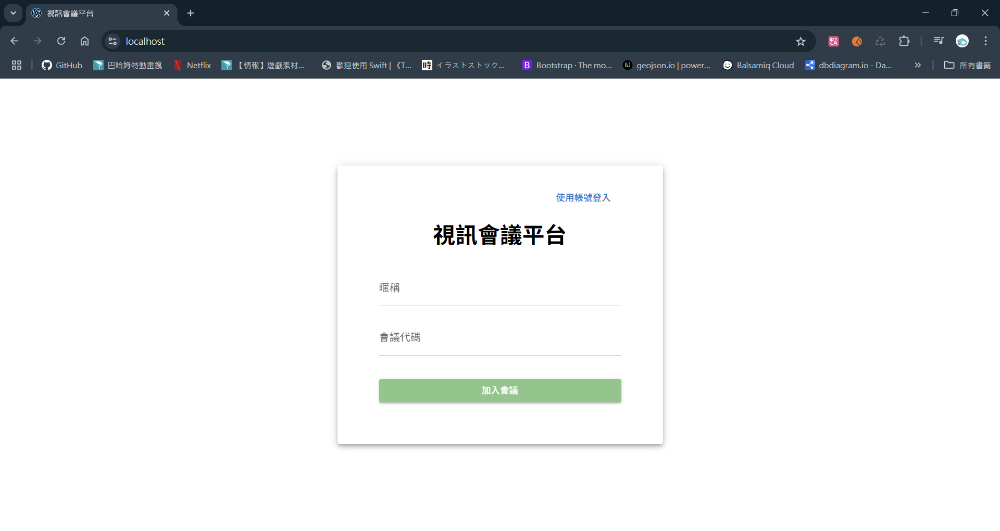
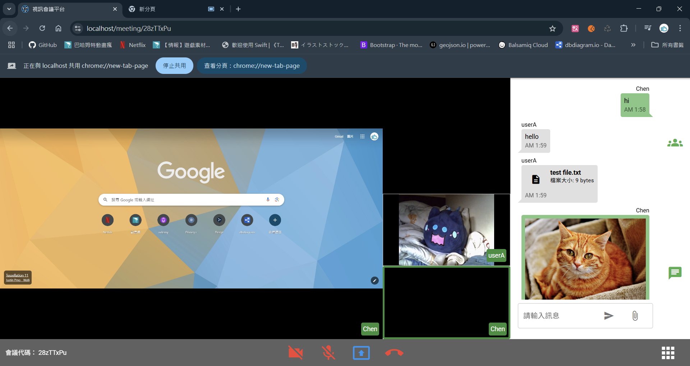
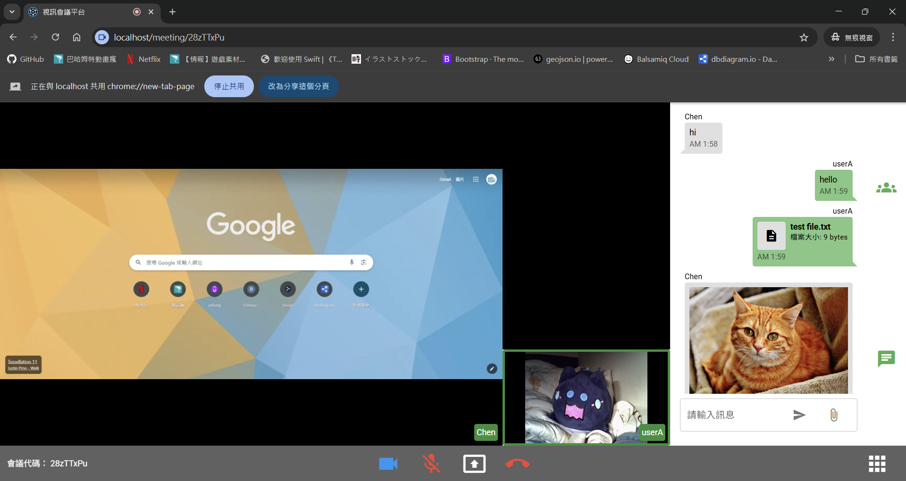

# MeetingWeb

此專案為多人視訊會議網站，提供多人視訊、即時訊息、畫面分享與文件共享的線上會議平台。

## 功能

- 多人視訊：支援多位參與者同時進行視訊會議
- 畫面分享：可在會議中分享螢幕畫面
- 即時訊息討論：支援會議期間的即時訊息交流
- 文件共享：上傳、下載會議相關文件
- 保存會議：會議房間及相關資料會被保留

## 專案架構

- 前端：Vue  
- 後端：Express  
- 資料庫：MongoDB  
- 即時通訊：WebRTC、ion-sfu、Socket.IO

## 實機畫面






## 啟動專案

### 前置準備

#### 建立 `.env` 檔案
根據專案資料夾內的 `.env.example` 檔案，分別在 `compose` 和 `server`以及 `web` 資料夾中建立 `.env` 檔案，並根據實際需求修改。

### 使用 Docker Compose 啟動

#### 安裝 Docker 和 Docker Compose
確保已安裝 [Docker](https://www.docker.com/) 和 [Docker Compose](https://docs.docker.com/compose/)。

#### 1. 打包前端
進入 `web` 資料夾，執行以下指令進行打包：
```bash
cd web
quasar build
```

#### 2. 啟動服務
在專案 `compose` 目錄下執行以下指令以啟動服務：
```bash
docker compose up -d
```

#### 3. 開啟瀏覽器
在瀏覽器中開啟以下網址以查看專案：
```
http://localhost
```
### 手動方式啟動

#### 1. 啟動 MongoDB
確保已安裝並啟動 MongoDB。

#### 2. 下載 ion-sfu

請先將 [ion-sfu](https://github.com/ionorg/ion-sfu) 專案 clone 至本機：

```bash
git clone https://github.com/pion/ion-sfu.git
```

進入 `ion-sfu` 資料夾並依照官方文件進行編譯與啟動。

#### 3. 啟動後端伺服器

##### 確保已安裝 Node.js
請先安裝 [Node.js](https://nodejs.org/)，以確保可以執行後端伺服器程式。

進入 `server` 資料夾，安裝依賴套件並啟動伺服器：
```bash
cd server
npm install
node server
```

#### 4. 啟動前端應用程式 (Quasar)
進入 `web` 資料夾，安裝依賴並啟動開發伺服器：
```bash
cd web
npm install
quasar dev
```

#### 5. 開啟瀏覽器
在瀏覽器中開啟以下網址以查看專案：
```
http://localhost:9000
```

## 資料夾結構

```
📂 meetingweb
├── 📂 compose                               # Docker Compose 配置檔案
│   ├── 📂 conf
│   │   └── 📄 nginx.conf                    # Nginx設定檔
│   ├── 📄 .env.example                      # 環境變數範例檔案
│   └── 📄 compose.yml
├── 📂 ion-sfu                               # SFU Server (git clone 後取得)
├── 📂 server                                # 後端程式碼
│   ├── 📂 files                             # 檔案存放 (server 端程式自動產生)
│   ├── 📂 node_modules
│   ├── 📂 services                          # 服務邏輯目錄
│   │   ├── 📂 api                           # API 路由處理
│   │   │   ├── 📄 account.js                # 帳戶相關 API
│   │   │   ├── 📄 file.js                   # 檔案相關 API
│   │   │   ├── 📄 jwt.js                    # 權限驗證相關 API
│   │   │   ├── 📄 main.js                   # API 路由
│   │   │   └── 📄 room.js                   # 會議房間相關 API
│   │   ├── 📂 database                      # 資料庫操作
│   │   │   ├── 📄 account.js                # 帳戶相關資料庫操作
│   │   │   ├── 📄 chat.js                   # 聊天室相關資料庫操作
│   │   │   ├── 📄 file.js                   # 檔案相關資料庫操作
│   │   │   ├── 📄 mongodb.js                # 資料庫連線池
│   │   │   ├── 📄 room.js                   # 會議房間相關資料庫操作
│   │   │   └── 📄 verification.js           # 驗證用相關資料庫操作
│   │   └── 📂 socket                        # 資料庫操作
│   │       └── 📄 main.js                   # Socket 事件處理
│   ├── 📄 .env.example                      # 環境變數範例檔案
│   ├── 📄 Dockerfile                  
│   ├── 📄 package.json                
│   ├── 📄 package-lock.json           
│   └── 📄 server.js                         # 後端主程式
├── 📂 web                                   # 前端程式碼
│   ├── 📂 .quasar
│   ├── 📂 .vscode
│   ├── 📂 dist                              # 打包後前端網頁 (quasar build 後)
│   ├── 📂 mode_modules
│   ├── 📂 public
│   ├── 📂 src
│   │   ├── 📂 assets
│   │   ├── 📂 boot                 
│   │   ├── 📂 components
│   │   │   ├── 📂 auth
│   │   │   │   ├── 📄 Forgetpwd.vue         # 忘記密碼元件
│   │   │   │   ├── 📄 Join.vue              # 加入會議元件
│   │   │   │   ├── 📄 Login.vue             # 帳戶登入元件
│   │   │   │   └── 📄 Register.vue          # 註冊帳戶元件
│   │   │   ├── 📂 meet_tools
│   │   │   │   ├── 📄 Chat.vue              # 聊天室元件
│   │   │   │   └── 📄 Member.vue            # 會議成員元件
│   │   │   ├── 📂 meetLayout
│   │   │   │   ├── 📄 MeetingDrawer.vue     # 會議layout側邊抽屜元件
│   │   │   │   └── 📄 MeetingFooter.vue     # 會議layout底部元件
│   │   │   ├── 📄 AudioStream.vue           # 音訊元件
│   │   │   └── 📄 VideoStream.vue           # 視訊元件
│   │   ├── 📂 css                     
│   │   ├── 📂 layouts                       # 頁面佈局
│   │   │   ├── 📄 MainLayout.vue            # 遊戲列表頁面
│   │   │   └── 📄 MeetingLayout.vue         # 遊戲頁面
│   │   ├── 📂 pages                         # 頁面組件
│   │   │   ├── 📄 EntryPage.vue             # 首頁
│   │   │   ├── 📄 ErrorNotFound.vue         # 404 錯誤頁面(預設)
│   │   │   ├── 📄 ExitPage.vue              # 離開會議頁面
│   │   │   ├── 📄 MeetingPage.vue           # 會議頁面
│   │   │   ├── 📄 RestPasswordPage.vue      # 重設密碼頁面
│   │   │   └── 📄 WeatingPage.vue           # 等待頁面
│   │   ├── 📂 request                       # API 管理
│   │   │   ├── 📄 account.js                # 帳戶相關
│   │   │   ├── 📄 file.js                   # 檔案相關
│   │   │   └── 📄 meeting.js                # 會議相關
│   │   ├── 📂 router                        # 路由 (vue-router)
│   │   ├── 📂 stores                        # 狀態管理 (Pinia)
│   │   │   ├── 📄 auth.js                   # 身分授權狀態管理
│   │   │   ├── 📄 chat.js                   # 聊天室狀態管理
│   │   │   ├── 📄 index.js
│   │   │   ├── 📄 ionsfu.js                 # ion-sfu (webrtc) 狀態管理
│   │   │   ├── 📄 meeting.js                # 會議狀態管理
│   │   │   ├── 📄 store-fig.d.ts
│   │   │   └── 📄 tab.js                    # 首頁元素狀態管理
│   │   └── 📄 App.vue
│   ├── 📄 .editorconfig
│   ├── 📄 .env.example
│   ├── 📄 .gitignore
│   ├── 📄 .npmrc
│   ├── 📄 index.html
│   ├── 📄 jsconfig.json
│   ├── 📄 package-lock.json
│   ├── 📄 package.json
│   ├── 📄 postcss.config.cjs
│   ├── 📄 quasar.config.js                  # Quasar 框架配置檔
│   └── 📄 README.md
├── 📄 .gitignore
└── 📄 README.md
```
